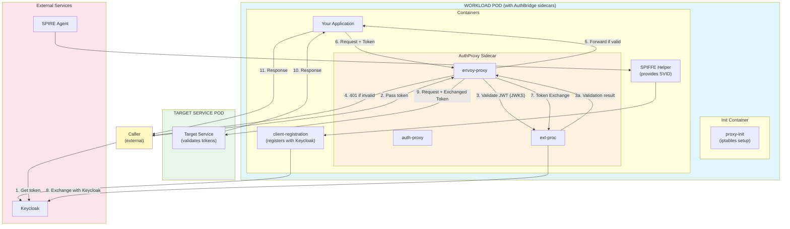
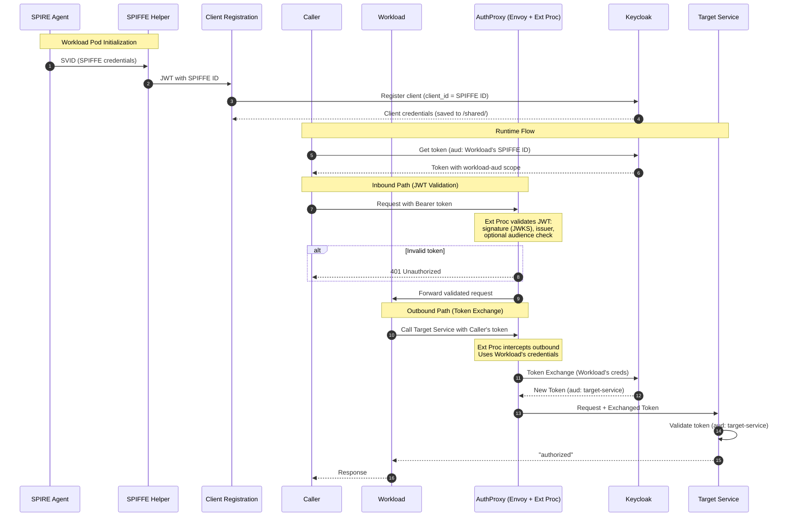

# AuthBridge

AuthBridge provides **secure, transparent token management** for Kubernetes workloads. It combines automatic [client registration](./client-registration/) with [token exchange](./AuthProxy/) capabilities, enabling zero-trust authentication flows with [SPIFFE/SPIRE](https://spiffe.io) integration.

> **📘 Looking to run the demo?** See the [Single-Target Demo](./demos/single-target/demo.md) or [Multi-Target Demo](./demos/multi-target/demo.md) for step-by-step instructions.

## What AuthBridge Does

AuthBridge solves the challenge of **secure service-to-service authentication** in Kubernetes:

1. **Automatic Identity** - Workloads automatically obtain their identity from SPIFFE/SPIRE and register as Keycloak clients using their SPIFFE ID (e.g., `spiffe://example.com/ns/default/sa/myapp`)

2. **Token-Based Authorization** - Callers obtain JWT tokens from Keycloak with the workload's identity as the audience, authorizing them to invoke specific services

3. **Transparent Token Exchange** - A sidecar intercepts outgoing requests, validates incoming tokens, and exchanges them for tokens with the appropriate target audience—all without application code changes

4. **Target Service Validation** - Target services validate the exchanged token, ensuring it has the correct audience before authorizing requests

## Architecture

```
                  Incoming request (with JWT)
                        │
                        ▼
┌───────────────────────────────────────────────────────────────────────┐
│                         WORKLOAD POD                                  │
│                   (with AuthBridge sidecars)                          │
│                                                                       │
│  ┌─────────────────────────────────────────────────────────────────┐  │
│  │  Init Container: proxy-init (iptables intercepts pod traffic,   │  │
│  │  excluding Keycloak port)                                       │  │
│  └─────────────────────────────────────────────────────────────────┘  │
│                        │                                              │
│                        ▼                                              │
│  ┌─────────────────────────────────────────────────────────────────┐  │
│  │                   AuthProxy Sidecar                             │  │
│  │                 (Envoy + Ext Proc)                              │  │
│  │                                                                 │  │
│  │  INBOUND:  Validates JWT (signature + issuer via JWKS)          │  │
│  │            Returns 401 Unauthorized if invalid                  │  │
│  │  OUTBOUND: Exchanges token → target-service audience            │  │
│  │            (using Workload's credentials)                       │  │
│  └──────────────────────┬──────────────────────────────────────────┘  │
│            ▲ outbound   │ inbound                                     │
│            │ request    │ (validated)                                 │
│            │            ▼                                             │
│  ┌─────────┴────────────────────┐  ┌───────────────────────────────┐  │
│  │         Your App             │  │  SPIFFE Helper                │  │
│  │                              │  │  (provides SPIFFE creds)      │  │
│  └──────────────────────────────┘  └───────────────────────────────┘  │
│                                                                       │
│  ┌─────────────────────────────────────────────────────────────────┐  │
│  │  client-registration (registers Workload with Keycloak)         │  │
│  └─────────────────────────────────────────────────────────────────┘  │
└───────────────────────────────────────────────────────────────────────┘
                        │
                        │ Exchanged token (aud: target-service)
                        ▼
              ┌─────────────────────┐
              │  TARGET SERVICE POD │
              │                     │
              │  Validates token    │
              │  with audience      │
              │  "target-service"   │
              └─────────────────────┘
```

<details>
<summary><b>📊 Mermaid Architecture Diagram (click to expand)</b></summary>



</details>

## Components

### Workload Pod

| Component | Type | Purpose |
|-----------|------|---------|
| `proxy-init` | init | Sets up iptables to intercept inbound and outbound traffic (excludes Keycloak port) |
| `client-registration` | container | Registers workload with Keycloak using SPIFFE ID, saves credentials to `/shared/` |
| `spiffe-helper` | container | Provides SPIFFE credentials (SVID) |
| `Your App` | container | Your application; the demo uses a pass-through proxy as an example |
| `AuthProxy Sidecar` | container | Composed of Envoy + external processing (`Ext Proc`) components (shown as separate nodes in diagrams): validates inbound JWTs (signature + issuer via JWKS, returns 401 if invalid) and exchanges outbound tokens (HTTP: token exchange via Ext Proc; HTTPS: TLS passthrough) |

### Target Service Pod

Any downstream service that validates incoming tokens have the expected audience.

## End-to-End Flow

**Initialization (Workload Pod Startup):**
```
  SPIRE Agent             Workload Pod                        Keycloak
       │                        │                                │
       │  0. SVID               │                                │
       │───────────────────────►│  SPIFFE Helper                 │
       │  (SPIFFE ID)           │                                │
       │                        │                                │
       │                        │  1. Register client            │
       │                        │  (client_id = SPIFFE ID)       │
       │                        │───────────────────────────────►│
       │                        │  Client Registration           │
       │                        │                                │
       │                        │◄───────────────────────────────│
       │                        │  client_secret                 │
       │                        │  (saved to /shared/)           │
```

**Runtime Flow:**
```
  Caller             Workload Pod              Keycloak      Target Service
    │                     │                        │               │
    │  2. Get token       │                        │               │
    │  (aud: Workload's SPIFFE ID)                 │               │
    │─────────────────────────────────────────────►│               │
    │◄─────────────────────────────────────────────│               │
    │  Token (aud: Workload)                       │               │
    │                     │                        │               │
    │  3. Pass token      │                        │               │
    │  to Workload        │                        │               │
    │────────────────────►│                        │               │
    │                     │──────────┐             │               │
    │                     │  Envoy intercepts      │               │
    │                     │  inbound request       │               │
    │                     │          │             │               │
    │                     │  Ext Proc validates    │               │
    │                     │  JWT (signature +      │               │
    │                     │  issuer via JWKS)      │               │
    │                     │          │             │               │
    │                     │  401 if invalid ──────►│ (rejected)    │
    │                     │          │             │               │
    │                     │  4. Forward to App     │               │
    │                     │  if valid              │               │
    │                     │◄─────────┘             │               │
    │                     │                        │               │
    │                     │  5. Workload calls     │               │
    │                     │  Target Service with   │               │
    │                     │  Caller's token        │               │
    │                     │──────────┐             │               │
    │                     │          │             │               │
    │                     │  Envoy intercepts      │               │
    │                     │  outbound request      │               │
    │                     │          │             │               │
    │                     │  6. Token Exchange     │               │
    │                     │  (using Workload creds)│               │
    │                     │───────────────────────►│               │
    │                     │◄───────────────────────│               │
    │                     │  New token (aud: target-service)       │
    │                     │          │             │               │
    │                     │  7. Forward request    │               │
    │                     │  with exchanged token  │               │
    │                     │───────────────────────────────────────►│
    │                     │                        │               │
    │                     │◄───────────────────────────────────────│
    │                     │  "authorized"          │               │
    │◄────────────────────│                        │               │
    │  Response           │                        │               │
```

## What Gets Verified

| Step | Component | Verification |
|------|-----------|--------------|
| 0 | SPIFFE Helper | SVID obtained from SPIRE Agent |
| 1 | Client Registration | Workload registered with Keycloak (client_id = SPIFFE ID) |
| 2 | Caller | Token obtained with `aud: Workload's SPIFFE ID` |
| 3 | Envoy + Ext Proc (inbound) | Inbound JWT validated: signature verified via JWKS, issuer checked, optional audience check. Returns 401 if invalid. |
| 4 | Workload | Validated request forwarded to application |
| 5 | Envoy + Ext Proc (outbound) | Outbound request intercepted; token exchanged using Workload's credentials → `aud: target-service` |
| 6 | Target Service | Token validated (`aud: target-service`), returns `"authorized"` |

## Detailed End-to-End Flow

<details>
<summary><b>📊 Mermaid Diagram (click to expand)</b></summary>



### Detailed Flow Summary

| Step | From → To | Action |
|------|-----------|--------|
| **Initialization Phase** |||
| 1 | SPIRE → SPIFFE Helper | Issue SVID (SPIFFE credentials) |
| 2 | SPIFFE Helper → Client Registration | Pass JWT with SPIFFE ID |
| 3 | Client Registration → Keycloak | Register client (`client_id` = SPIFFE ID) |
| 4 | Keycloak → Client Registration | Return client credentials (saved to `/shared/`) |
| **Runtime Phase — Inbound (JWT Validation)** |||
| 5 | Caller → Keycloak | Request token (`aud`: Workload's SPIFFE ID) |
| 6 | Keycloak → Caller | Return token with workload-aud scope |
| 7 | Caller → Envoy (inbound) | Request intercepted by iptables, routed to Envoy inbound listener |
| 8 | Envoy → Ext Proc | Validate JWT: signature (JWKS), issuer, optional audience. Returns 401 if invalid. |
| 9 | Envoy → Workload | Forward validated request to application |
| **Runtime Phase — Outbound (Token Exchange)** |||
| 10 | Workload → Envoy (outbound) | Outbound request intercepted by iptables, routed to Envoy outbound listener |
| 11 | Envoy → Ext Proc → Keycloak | Token Exchange (using Workload's credentials) |
| 12 | Keycloak → Envoy | Return new token (`aud`: target-service) |
| 13 | Envoy → Target Service | Forward request with exchanged token |
| 14 | Target Service | Validate token (`aud`: target-service) |
| 15 | Target Service → Workload | Return "authorized" |
| 16 | Workload → Caller | Return response |

</details>

## Key Security Properties

- **No Static Secrets** - Credentials are dynamically generated during registration
- **Short-Lived Tokens** - JWT tokens expire and must be refreshed
- **Inbound JWT Validation** - Incoming requests are validated at the sidecar (signature via JWKS, issuer, optional audience) before reaching the application
- **Self-Audience Scoping** - Tokens include the Workload's own identity as audience, enabling token exchange
- **Same Identity for Exchange** - AuthProxy uses the Workload's credentials (same SPIFFE ID), matching the token's audience
- **Transparent to Application** - Both inbound validation and outbound token exchange are handled by the sidecar; applications don't need to implement either
- **Configurable Targets** - Route-based configuration maps destination hosts to target audiences

## Prerequisites

- Kubernetes cluster (Kind recommended for local development)
- SPIRE installed and running (server + agent) - for SPIFFE version
- Keycloak deployed
- Docker/Podman for building images

### Quick Setup

The easiest way to get all prerequisites is to use the [Kagenti Ansible installer](https://github.com/kagenti/kagenti/blob/main/docs/install.md#ansible-based-installer-recommended).

## Getting Started

### Demos

- **[GitHub Issue Agent Demo](./demos/github-issue/demo.md)** - End-to-end demo with the real GitHub Issue Agent and GitHub MCP Tool, showing transparent token exchange via AuthBridge
  - [Manual deployment](./demos/github-issue/demo-manual.md) — deploy everything via `kubectl` and YAML manifests
- **[Single-Target Demo](./demos/single-target/demo.md)** - Basic token exchange to one target service
- **[Multi-Target Demo](./demos/multi-target/demo.md)** - Route-based token exchange to multiple targets

All demos cover configuring Keycloak, deploying, and testing.

### Route-Based Configuration

AuthBridge supports per-host token exchange configuration via `routes.yaml`:

```yaml
# Exchange tokens for target-alpha audience when calling this host
- host: "target-alpha-service.authbridge.svc.cluster.local"
  target_audience: "target-alpha"
  token_scopes: "openid target-alpha-aud"

# Glob patterns supported
- host: "*.internal.svc.cluster.local"
  passthrough: true  # Skip token exchange
```

### Keycloak Sync

Use `keycloak_sync.py` to reconcile routes.yaml with Keycloak configuration:

```bash
python keycloak_sync.py --config routes.yaml --agent-client "spiffe://..." --yes
```

This creates target clients, audience scopes, and assigns scopes to the agent.

## Component Documentation

- [AuthProxy](AuthProxy/README.md) - Token validation and exchange proxy
- [Client Registration](client-registration/README.md) - Automatic Keycloak client registration with SPIFFE

## References

- [Kagenti Installation](https://github.com/kagenti/kagenti/blob/main/docs/install.md)
- [SPIRE Documentation](https://spiffe.io/docs/latest/)
- [OAuth 2.0 Token Exchange (RFC 8693)](https://www.rfc-editor.org/rfc/rfc8693)
