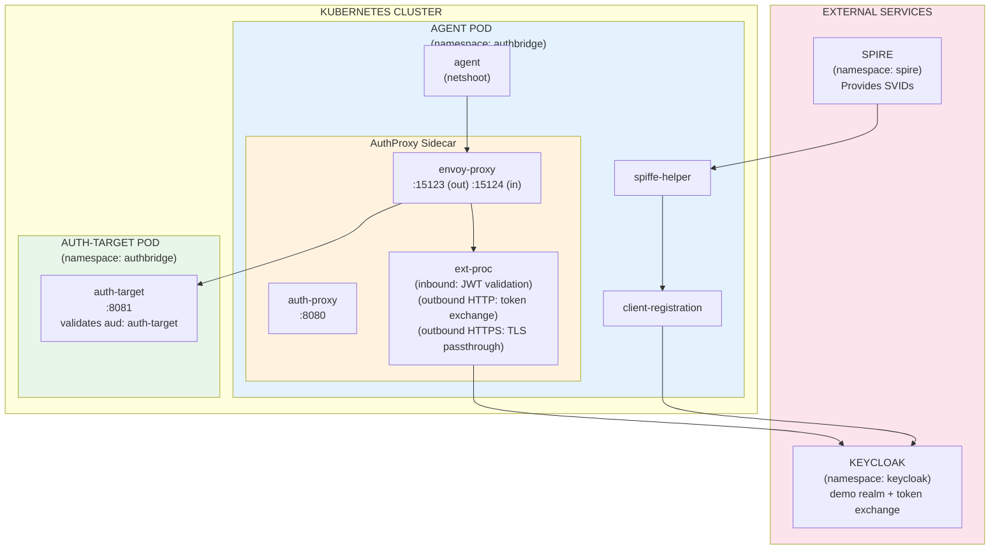
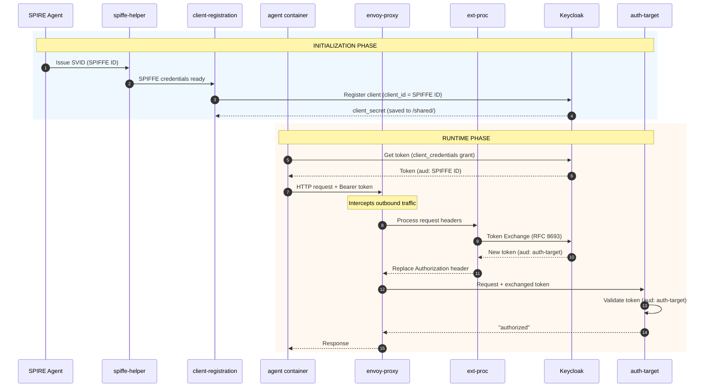

# AuthBridge Demo Guide

This guide provides step-by-step instructions for running the AuthBridge demo.

> **📘 New to AuthBridge?** See the [README](./README.md) for an overview of what AuthBridge does and how it works.

## Demo Components

The demo deploys the following components:

```
┌─────────────────────────────────────────────────────────────────────────────┐
│                              KUBERNETES CLUSTER                             │
│                                                                             │
│  ┌─────────────────────────────────────────────────────────────────────┐    │
│  │                    AGENT POD (namespace: authbridge)                │    │
│  │                                                                     │    │
│  │  ┌─────────────┐  ┌─────────────┐  ┌──────────────────────────────┐ │    │
│  │  │    agent    │  │   spiffe-   │  │      client-registration     │ │    │
│  │  │ (netshoot)  │  │   helper    │  │  (registers with Keycloak)   │ │    │
│  │  └─────────────┘  └─────────────┘  └──────────────────────────────┘ │    │
│  │                                                                     │    │
│  │  ┌───────────────────────────────────────────────────────────────┐  │    │
│  │  │                    AuthProxy Sidecar                          │  │    │
│  │  │  ┌────────────┐  ┌──────────────┐  ┌────────────────────────┐ │  │    │
│  │  │  │ auth-proxy │  │ envoy-proxy  │  │       ext-proc         │ │  │    │
│  │  │  │  (8080)    │  │ (15123 out)  │  │  (inbound: JWT valid.) │ │  │    │
│  │  │  │            │  │ (15124 in)   │  │  (outbound: token xch) │ │  │    │
│  │  │  └────────────┘  └──────────────┘  └────────────────────────┘ │  │    │
│  │  └───────────────────────────────────────────────────────────────┘  │    │
│  └─────────────────────────────────────────────────────────────────────┘    │
│                                      │                                      │
│                                      ▼                                      │
│  ┌─────────────────────────────────────────────────────────────────────┐    │
│  │                 AUTH-TARGET POD (namespace: authbridge)             │    │
│  │                                                                     │    │
│  │  ┌─────────────────────────────────────────────────────────────┐    │    │
│  │  │                      auth-target (8081)                     │    │    │
│  │  │               Validates tokens with aud: auth-target        │    │    │
│  │  └─────────────────────────────────────────────────────────────┘    │    │
│  └─────────────────────────────────────────────────────────────────────┘    │
│                                                                             │
├─────────────────────────────────────────────────────────────────────────────┤
│                            EXTERNAL SERVICES                                │
│                                                                             │
│  ┌──────────────────────┐          ┌──────────────────────┐                 │
│  │   SPIRE (namespace:  │          │ KEYCLOAK (namespace: │                 │
│  │       spire)         │          │     keycloak)        │                 │
│  │                      │          │                      │                 │
│  │  Provides SPIFFE     │          │  - demo realm        │                 │
│  │  identities (SVIDs)  │          │  - token exchange    │                 │
│  └──────────────────────┘          └──────────────────────┘                 │
└─────────────────────────────────────────────────────────────────────────────┘
```

<details>
<summary><b>📊 Mermaid Component Diagram (click to expand)</b></summary>



</details>

## Demo Flow

The following diagram shows the complete token flow from initialization through request handling:

```
┌──────────────────────────────────────────────────────────────────────────────┐
│                           INITIALIZATION PHASE                               │
└──────────────────────────────────────────────────────────────────────────────┘

  SPIRE Agent           Agent Pod                              Keycloak
       │                    │                                      │
       │ 1. Issue SVID      │                                      │
       │ ──────────────────►│ spiffe-helper                        │
       │   (SPIFFE ID)      │                                      │
       │                    │                                      │
       │                    │ 2. Register client                   │
       │                    │    (client_id = SPIFFE ID)           │
       │                    │ ────────────────────────────────────►│
       │                    │    client-registration               │
       │                    │                                      │
       │                    │◄─────────────────────────────────────│
       │                    │    client_secret                     │
       │                    │    (saved to /shared/)               │

┌──────────────────────────────────────────────────────────────────────────────┐
│                            RUNTIME PHASE                                     │
└──────────────────────────────────────────────────────────────────────────────┘

  Agent Container        AuthProxy Sidecar        Keycloak          Auth-Target
       │                        │                    │                    │
       │ 3. Get token           │                    │                    │
       │    (client_credentials)│                    │                    │
       │────────────────────────┼───────────────────►│                    │
       │◄───────────────────────┼────────────────────│                    │
       │    Token: aud=SPIFFE ID│                    │                    │
       │                        │                    │                    │
       │ 4. Call auth-target    │                    │                    │
       │    with token          │                    │                    │
       │───────────────────────►│                    │                    │
       │                        │                    │                    │
       │                   ┌────┴────┐               │                    │
       │                   │ Envoy   │               │                    │
       │                   │inbound  │               │                    │
       │                   │intercept│               │                    │
       │                   └────┬────┘               │                    │
       │                        │                    │                    │
       │                        │ 4b. Validate JWT   │                    │
       │                        │     (ext-proc)     │                    │
       │                        │     ✓ signature    │                    │
       │                        │     ✓ issuer       │                    │
       │                        │                    │                    │
       │                   ┌────┴────┐               │                    │
       │                   │ Envoy   │               │                    │
       │                   │outbound │               │                    │
       │                   │intercept│               │                    │
       │                   └────┬────┘               │                    │
       │                        │                    │                    │
       │                        │ 5. Token Exchange  │                    │
       │                        │    (ext-proc)      │                    │
       │                        │───────────────────►│                    │
       │                        │◄───────────────────│                    │
       │                        │  New token:        │                    │
       │                        │  aud=auth-target   │                    │
       │                        │                    │                    │
       │                        │ 6. Forward request │                    │
       │                        │    with new token  │                    │
       │                        │────────────────────────────────────────►│
       │                        │                    │                    │
       │                        │◄────────────────────────────────────────│
       │                        │                 "authorized"            │
       │◄───────────────────────│                    │                    │
       │    Response            │                    │                    │
```

<details>
<summary><b>📊 Mermaid Sequence Diagram (click to expand)</b></summary>



</details>

### What Gets Verified

| Step | Component | Action | Verification |
|------|-----------|--------|--------------|
| 1 | SPIRE → spiffe-helper | Issue SVID | Pod receives cryptographic identity (SPIFFE ID) |
| 2 | setup_keycloak.py | Configure realm | Creates `demo` realm, `auth-target` client, scopes, and demo user `alice` |
| 3 | client-registration → Keycloak | Register client | Keycloak client created with `client_id = SPIFFE ID` |
| 4 | agent → Keycloak | Get token | Token issued with `aud: SPIFFE ID`, `scope: agent-spiffe-aud` |
| 5 | agent → envoy-proxy | HTTP request | Envoy intercepts inbound traffic, Ext Proc validates JWT (signature + issuer) |
| 5b | ext-proc | Inbound validation | JWT signature validated via JWKS, issuer checked against `ISSUER` env var, 401 returned if invalid |
| 6 | ext-proc → Keycloak | Token Exchange | Outbound: token exchanged: `aud: SPIFFE ID` → `aud: auth-target` |
| 7 | envoy-proxy → auth-target | Forward request | Request sent with exchanged token |
| 7b | Subject preservation | User token exchange | `sub` and `preferred_username` preserved through exchange |
| 8 | auth-target | Validate token | Token validated (`aud: auth-target`), returns `"authorized"` |

### Key Security Properties

| Property | How It's Achieved |
|----------|-------------------|
| **No hardcoded secrets** | Client credentials generated dynamically by client-registration |
| **Identity-based auth** | SPIFFE ID serves as both pod identity and Keycloak client ID |
| **Audience scoping** | First token is scoped to Agent; exchanged token is scoped to auth-target |
| **Transparent to app** | Agent code just makes HTTP calls; AuthProxy handles token exchange |
| **Audit trail** | `azp` claim shows which client (SPIFFE ID) performed the exchange |

---

## End-to-End Testing Guide

### Step 1: Build and Load AuthProxy Images

*Note: This step will be replaced by the CI pipeline. The images will be auto-created*

```bash
cd AuthBridge/AuthProxy

# Build all images
make build-images

# Load images into Kind cluster
make load-images
```

### Step 2: Configure Keycloak

Assuming Keycloak is running as a part of the Kagenti install, port-forward Keycloak to access it locally:

```bash
kubectl port-forward service/keycloak-service -n keycloak 8080:8080
```

In a new terminal, run the setup script:

```bash
cd AuthBridge

# Create virtual environment
python -m venv venv
source venv/bin/activate

# Install dependencies
pip install --upgrade pip
pip install -r requirements.txt

# Run setup script
python setup_keycloak.py
```

The `setup_keycloak` script creates:

- `demo` realm
- `auth-target` client (token exchange target audience)
- `agent-spiffe-aud` scope (realm default - adds Agent's SPIFFE ID to all tokens)
- `auth-target-aud` scope (for exchanged tokens)
- `alice` demo user (username: `alice`, password: `alice123`) for testing user token flows

**Note:** No static `agent` client is created - the AuthProxy uses the dynamically
registered client credentials from `/shared/` (populated by client-registration).

### Step 3: Configure GitHub Image Pull Secret (if needed)

If using Kagenti, copy the ghcr secret:

```bash
kubectl get secret ghcr-secret -n team1 -o yaml | sed 's/namespace: team1/namespace: authbridge/' | kubectl apply -f -
```

### Step 4: Deploy the Demo

```bash
cd AuthBridge

# With SPIFFE (requires SPIRE)
kubectl apply -f demos/single-target/k8s/authbridge-deployment.yaml
```

OR without SPIFFE:

```bash
kubectl apply -f demos/single-target/k8s/authbridge-deployment-no-spiffe.yaml
```

This creates:

- `authbridge` namespace
- `agent` ServiceAccount
- ConfigMaps and Secrets (including `auth-proxy-config`)
- `agent` and `auth-target` deployments

### Step 5: Wait for Deployments

```bash
kubectl wait --for=condition=available --timeout=180s deployment/agent -n authbridge
kubectl wait --for=condition=available --timeout=120s deployment/auth-target -n authbridge
```

### Step 6: Test the Flow

These tests verify both **inbound** JWT validation and **outbound** token exchange end-to-end. By sending requests from outside the agent pod, each request exercises the full pipeline:

1. **Inbound**: Envoy intercepts the incoming request, ext-proc validates the JWT (signature + issuer)
2. **Outbound**: auth-proxy forwards to auth-target, Envoy intercepts the outgoing request, ext-proc exchanges the token

#### Setup

```bash
# Get the agent pod IP (requests must come from outside the pod to hit inbound validation)
AGENT_POD_IP=$(kubectl get pod -l app=agent -n authbridge -o jsonpath='{.items[0].status.podIP}')

# Get a service account token
TOKEN=$(kubectl exec deployment/agent -n authbridge -c agent -- sh -c '
  CLIENT_ID=$(cat /shared/client-id.txt)
  CLIENT_SECRET=$(cat /shared/client-secret.txt)
  curl -s http://keycloak-service.keycloak.svc:8080/realms/demo/protocol/openid-connect/token \
    -d "grant_type=client_credentials" -d "client_id=$CLIENT_ID" -d "client_secret=$CLIENT_SECRET" | jq -r ".access_token"
')

# Get a user token for alice (for subject preservation test)
USER_TOKEN=$(kubectl exec deployment/agent -n authbridge -c agent -- sh -c '
  CLIENT_ID=$(cat /shared/client-id.txt)
  CLIENT_SECRET=$(cat /shared/client-secret.txt)
  curl -s http://keycloak-service.keycloak.svc:8080/realms/demo/protocol/openid-connect/token \
    -d "grant_type=password" -d "client_id=$CLIENT_ID" -d "client_secret=$CLIENT_SECRET" \
    -d "username=alice" -d "password=alice123" | jq -r ".access_token"
')

# Start a test client pod (sends requests from outside the agent pod)
kubectl run test-client --image=nicolaka/netshoot -n authbridge --restart=Never -- sleep 3600
kubectl wait --for=condition=ready pod/test-client -n authbridge --timeout=30s
```

#### 6a. Inbound Rejection - No Token

```bash
kubectl exec test-client -n authbridge -- curl -s http://$AGENT_POD_IP:8080/test
# Expected: {"error":"unauthorized","message":"missing Authorization header"}
```

#### 6b. Inbound Rejection - Invalid Token

```bash
kubectl exec test-client -n authbridge -- curl -s -H "Authorization: Bearer invalid-token" http://$AGENT_POD_IP:8080/test
# Expected: {"error":"unauthorized","message":"token validation failed: ..."}
```

#### 6c. End-to-End with Service Account Token

Inbound validation passes, outbound token exchange converts `aud: <agent SPIFFE ID>` → `aud: auth-target`:

```bash
kubectl exec test-client -n authbridge -- curl -s -H "Authorization: Bearer $TOKEN" http://$AGENT_POD_IP:8080/test
# Expected: "authorized"
```

#### 6d. End-to-End with User Token (Subject Preservation)

Same as 6c, but using alice's user token. The `sub` and `preferred_username` claims are preserved through token exchange:

```bash
kubectl exec test-client -n authbridge -- curl -s -H "Authorization: Bearer $USER_TOKEN" http://$AGENT_POD_IP:8080/test
# Expected: "authorized"
```

**Key Difference (6c vs 6d):** Compare the `sub` and `preferred_username` claims:
- Service account token: `sub` is a service account ID, `preferred_username` is like `service-account-spiffe://...`
- User token: `sub` is alice's user ID, `preferred_username` is `alice`

#### Clean Up

```bash
kubectl delete pod test-client -n authbridge --ignore-not-found
```

#### Quick Test Commands

Run all tests as a single script:

```bash
AGENT_POD_IP=$(kubectl get pod -l app=agent -n authbridge -o jsonpath='{.items[0].status.podIP}')
kubectl run test-client --image=nicolaka/netshoot -n authbridge --restart=Never -- sleep 3600 2>/dev/null
kubectl wait --for=condition=ready pod/test-client -n authbridge --timeout=30s

TOKEN=$(kubectl exec deployment/agent -n authbridge -c agent -- sh -c '
  CLIENT_ID=$(cat /shared/client-id.txt); CLIENT_SECRET=$(cat /shared/client-secret.txt)
  curl -s http://keycloak-service.keycloak.svc:8080/realms/demo/protocol/openid-connect/token \
    -d "grant_type=client_credentials" -d "client_id=$CLIENT_ID" -d "client_secret=$CLIENT_SECRET" | jq -r ".access_token"
')

USER_TOKEN=$(kubectl exec deployment/agent -n authbridge -c agent -- sh -c '
  CLIENT_ID=$(cat /shared/client-id.txt); CLIENT_SECRET=$(cat /shared/client-secret.txt)
  curl -s http://keycloak-service.keycloak.svc:8080/realms/demo/protocol/openid-connect/token \
    -d "grant_type=password" -d "client_id=$CLIENT_ID" -d "client_secret=$CLIENT_SECRET" \
    -d "username=alice" -d "password=alice123" | jq -r ".access_token"
')

echo "=== 6a. No Token (expect 401) ==="
kubectl exec test-client -n authbridge -- curl -s http://$AGENT_POD_IP:8080/test
echo ""

echo "=== 6b. Invalid Token (expect 401) ==="
kubectl exec test-client -n authbridge -- curl -s -H "Authorization: Bearer invalid-token" http://$AGENT_POD_IP:8080/test
echo ""

echo "=== 6c. Service Account Token (expect authorized) ==="
kubectl exec test-client -n authbridge -- curl -s -H "Authorization: Bearer $TOKEN" http://$AGENT_POD_IP:8080/test
echo ""

echo "=== 6d. User Token - alice (expect authorized) ==="
kubectl exec test-client -n authbridge -- curl -s -H "Authorization: Bearer $USER_TOKEN" http://$AGENT_POD_IP:8080/test
echo ""

kubectl delete pod test-client -n authbridge --ignore-not-found
```

### Step 7: Inspect Token Claims (Before and After Exchange)

This step shows how the token claims change during exchange for **both** service account and user tokens.

#### 7a. Service Account Token - Before and After

```bash
kubectl exec deployment/agent -n authbridge -c agent -- sh -c '
CLIENT_ID=$(cat /shared/client-id.txt)
CLIENT_SECRET=$(cat /shared/client-secret.txt)

TOKEN=$(curl -s http://keycloak-service.keycloak.svc:8080/realms/demo/protocol/openid-connect/token \
  -d "grant_type=client_credentials" \
  -d "client_id=$CLIENT_ID" \
  -d "client_secret=$CLIENT_SECRET" | jq -r ".access_token")

echo "=== SERVICE ACCOUNT TOKEN (Before Exchange) ==="
echo $TOKEN | cut -d"." -f2 | tr "_-" "/+" | { read p; echo "${p}=="; } | base64 -d | jq "{aud, azp, iss, sub, preferred_username, scope}"

echo ""
echo "Calling auth-target... (token exchange happens)"
curl -s -H "Authorization: Bearer $TOKEN" http://auth-target-service:8081/test
echo ""
'
```

Then check auth-target logs for the **exchanged** token:

```bash
echo "=== SERVICE ACCOUNT TOKEN (After Exchange) ===" && \
kubectl logs deployment/auth-target -n authbridge --tail=20 | grep -E "(Subject|Audience|Authorized Party|Preferred)" || echo "Check logs manually"
```

#### 7b. User Token (alice) - Before and After

```bash
kubectl exec deployment/agent -n authbridge -c agent -- sh -c '
CLIENT_ID=$(cat /shared/client-id.txt)
CLIENT_SECRET=$(cat /shared/client-secret.txt)

USER_TOKEN=$(curl -s http://keycloak-service.keycloak.svc:8080/realms/demo/protocol/openid-connect/token \
  -d "grant_type=password" \
  -d "client_id=$CLIENT_ID" \
  -d "client_secret=$CLIENT_SECRET" \
  -d "username=alice" \
  -d "password=alice123" | jq -r ".access_token")

echo "=== USER TOKEN - alice (Before Exchange) ==="
echo $USER_TOKEN | cut -d"." -f2 | tr "_-" "/+" | { read p; echo "${p}=="; } | base64 -d | jq "{aud, azp, iss, sub, preferred_username, scope}"

echo ""
echo "Calling auth-target with alice token... (token exchange happens)"
curl -s -H "Authorization: Bearer $USER_TOKEN" http://auth-target-service:8081/test
echo ""
'
```

Then check auth-target logs for the **exchanged** token (note `sub` and `preferred_username` are preserved!):

```bash
echo "=== USER TOKEN - alice (After Exchange) ===" && \
kubectl logs deployment/auth-target -n authbridge --tail=10 | grep -E "(Subject|Audience|Authorized Party|Preferred)" || echo "Check logs manually"
```

#### Token Claims Comparison

| Claim | Service Account (Before) | Service Account (After) | User Token (Before) | User Token (After) |
|-------|--------------------------|-------------------------|---------------------|-------------------|
| `aud` | Agent's SPIFFE ID | `auth-target` | Agent's SPIFFE ID | `auth-target` |
| `azp` | Agent's SPIFFE ID | Agent's SPIFFE ID | Agent's SPIFFE ID | Agent's SPIFFE ID |
| `sub` | Service account ID | Service account ID | **alice's user ID** | **alice's user ID** |
| `preferred_username` | `service-account-spiffe://...` | same | **`alice`** | **`alice`** |
| `scope` | `agent-spiffe-aud profile email` | `auth-target-aud` | `agent-spiffe-aud profile email` | `auth-target-aud` |

**Key Insight: Subject Preservation**
- The `sub` claim (user identity) is **preserved** through token exchange!
- For service accounts: `sub` remains the service account ID
- For users: `sub` remains alice's user ID - enabling user attribution at the target service
- The `azp` claim shows which client (Agent's SPIFFE ID) performed the exchange

#### Why Subject Preservation Matters

1. **User Attribution:** The target service knows the request is from alice, not just "some agent"
2. **Audit Trail:** `sub=<alice user id>`, `preferred_username=alice`, `azp=agent-spiffe-id` shows the full delegation chain
3. **Authorization Decisions:** Target can apply user-specific policies (alice's permissions)
4. **Compliance:** User actions are traceable even through agent intermediaries

#### Security Model Benefits

- The `agent-spiffe-aud` scope adds the Agent's SPIFFE ID to all tokens' audience
- The AuthProxy uses the same credentials as the registered client (matching the token's audience)
- No static secrets - credentials are dynamically generated by client-registration
- Clear audit trail via the `azp` claim
- Token exchange logic is handled by the sidecar, transparent to the application code

## Verification

### Check Client Registration

```bash
kubectl logs deployment/agent -n authbridge -c client-registration
```

You should see:

```shell
SPIFFE credentials ready!
Client ID (SPIFFE ID): spiffe://...
Created Keycloak client "spiffe://..."
Client registration complete!
```

### Check Token Exchange

```bash
kubectl logs deployment/agent -n authbridge -c envoy-proxy 2>&1 | grep -i "token"
```

You should see:

```shell
[Token Exchange] Configuration loaded, attempting token exchange
[Token Exchange] Successfully exchanged token, replacing Authorization header
```

### Check Auth Target

```bash
kubectl logs deployment/auth-target -n authbridge
```

You should see:

```shell
[JWT Debug] Successfully validated token
[JWT Debug] Audience: [auth-target]
Authorized request: GET /test
```

## Troubleshooting

### Client Registration Can't Reach Keycloak

**Symptom:** `Connection refused` when connecting to Keycloak

**Fix:** Ensure `OUTBOUND_PORTS_EXCLUDE: "8080"` is set in proxy-init env vars. This excludes Keycloak port from iptables redirect.

### Inbound JWT Validation Fails with "invalid issuer"

**Symptom:** `{"error":"unauthorized","message":"token validation failed: invalid issuer: expected ..., got ..."}`

**Cause:** The Keycloak frontend URL (used as the `iss` claim in tokens) differs from the internal service URL used in `TOKEN_URL`. This is common in Kubernetes where Keycloak is accessed externally via `keycloak.localtest.me` but internally via `keycloak-service.keycloak.svc`.

**Fix:** Set the `ISSUER` field in the `auth-proxy-config` secret to match Keycloak's frontend URL:

```yaml
stringData:
  ISSUER: "http://keycloak.localtest.me:8080/realms/demo"
```

The `ISSUER` env var is required for inbound JWT validation. It must match the Keycloak frontend URL that appears as the `iss` claim in tokens.

### Token Exchange Fails with "Audience not found"

**Symptom:** `{"error":"invalid_client","error_description":"Audience not found"}`

**Fix:** The `auth-target` client must exist in Keycloak. Run `setup_keycloak.py` which creates it.

### Token Exchange Fails with "Client is not within the token audience"

**Symptom:** Token exchange fails with error:
```
{"error":"access_denied","error_description":"Client is not within the token audience"}
```

**Cause:** The caller's token doesn't include the Agent's SPIFFE ID in its audience. Keycloak requires the exchanging client to be in the token's audience for security reasons.

**Fix:** Add the `agent-spiffe-aud` scope to the caller client:

```bash
kubectl exec deployment/agent -n authbridge -c agent -- sh -c '
ADMIN_TOKEN=$(curl -s http://keycloak-service.keycloak.svc:8080/realms/master/protocol/openid-connect/token \
  -d "grant_type=password" -d "client_id=admin-cli" -d "username=admin" -d "password=admin" | jq -r ".access_token")

SCOPE_ID=$(curl -s -H "Authorization: Bearer $ADMIN_TOKEN" \
  "http://keycloak-service.keycloak.svc:8080/admin/realms/demo/client-scopes" | \
  jq -r ".[] | select(.name==\"agent-spiffe-aud\") | .id")

CLIENT_ID=$(cat /shared/client-id.txt)
INTERNAL_ID=$(curl -s -H "Authorization: Bearer $ADMIN_TOKEN" \
  "http://keycloak-service.keycloak.svc:8080/admin/realms/demo/clients?clientId=$CLIENT_ID" | jq -r ".[0].id")

curl -s -X PUT -H "Authorization: Bearer $ADMIN_TOKEN" \
  "http://keycloak-service.keycloak.svc:8080/admin/realms/demo/clients/$INTERNAL_ID/default-client-scopes/$SCOPE_ID"

echo "Added agent-spiffe-aud scope to $CLIENT_ID"
'
```

**Note:** This is a security feature, not a limitation. The `agent-spiffe-aud` scope adds the Agent's SPIFFE ID to the token's audience, authorizing the AuthProxy (using the same credentials) to exchange tokens.

### Token Exchange Fails with "Client not enabled to retrieve service account"

**Symptom:** `{"error":"unauthorized_client","error_description":"Client not enabled to retrieve service account"}`

**Fix:** The caller's client needs `serviceAccountsEnabled: true`. This is set in the updated `client_registration.py`.

### curl/jq Not Found in Agent Container

**Symptom:** `sh: curl: not found` or `sh: jq: not found`

**Fix:** The agent container should use `nicolaka/netshoot:latest` image which has these tools pre-installed.

### No Token Received

**Symptom:** `echo $TOKEN=null`

**Fix:** Make sure the `serviceAccountsEnabled` is present in the `client-registration` image.

#### Enable Service Accounts for the Registered Client

The published `client-registration` image doesn't yet have the `serviceAccountsEnabled` fix. Run this to enable it:

```bash
kubectl exec deployment/agent -n authbridge -c agent -- sh -c '
CLIENT_ID=$(cat /shared/client-id.txt)
echo "Enabling service accounts for: $CLIENT_ID"

ADMIN_TOKEN=$(curl -s http://keycloak-service.keycloak.svc:8080/realms/master/protocol/openid-connect/token \
  -d "grant_type=password" -d "client_id=admin-cli" -d "username=admin" -d "password=admin" | jq -r ".access_token")

INTERNAL_ID=$(curl -s -H "Authorization: Bearer $ADMIN_TOKEN" \
  "http://keycloak-service.keycloak.svc:8080/admin/realms/demo/clients?clientId=$CLIENT_ID" | jq -r ".[0].id")

curl -s -X PUT -H "Authorization: Bearer $ADMIN_TOKEN" -H "Content-Type: application/json" \
  "http://keycloak-service.keycloak.svc:8080/admin/realms/demo/clients/$INTERNAL_ID" \
  -d "{\"clientId\": \"$CLIENT_ID\", \"serviceAccountsEnabled\": true}"

echo "Done!"
'
```

### View All Logs

```bash
# Agent pod containers
kubectl logs deployment/agent -n authbridge -c agent
kubectl logs deployment/agent -n authbridge -c client-registration
kubectl logs deployment/agent -n authbridge -c spiffe-helper
kubectl logs deployment/agent -n authbridge -c auth-proxy
kubectl logs deployment/agent -n authbridge -c envoy-proxy

# Auth Target
kubectl logs deployment/auth-target -n authbridge
```

## Cleanup

```bash
kubectl delete -f demos/single-target/k8s/authbridge-deployment.yaml
# OR
kubectl delete -f demos/single-target/k8s/authbridge-deployment-no-spiffe.yaml

# Delete the namespace (removes everything)
kubectl delete namespace authbridge
```

## Next Steps

- See [AuthProxy Documentation](AuthProxy/README.md) for details on token validation and exchange
- See [Client Registration Documentation](client-registration/README.md) for details on automatic Keycloak registration
- See [README](./README.md) for architecture overview
