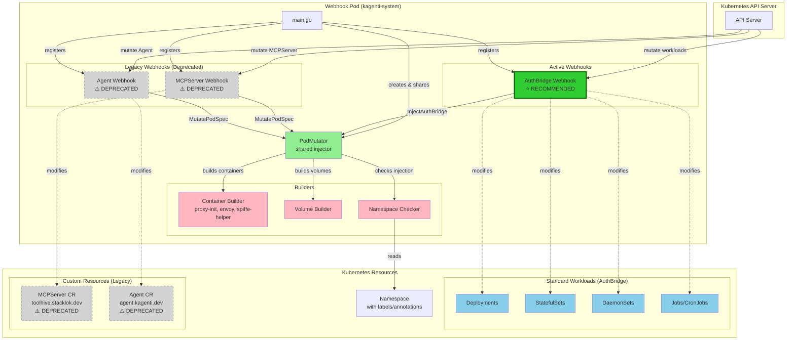
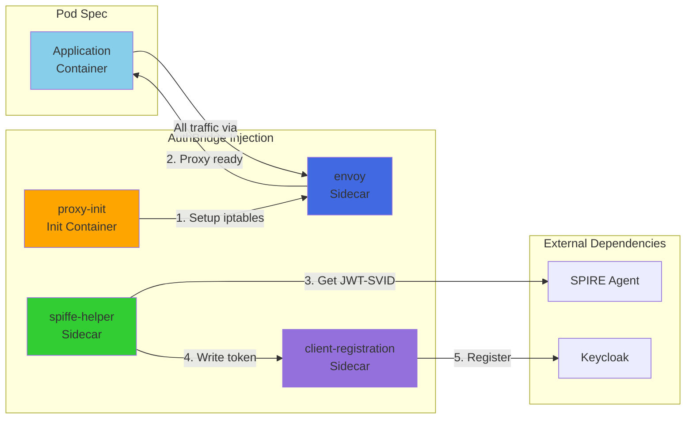
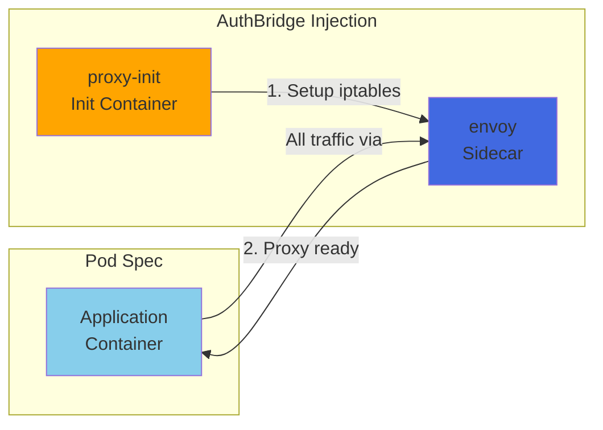
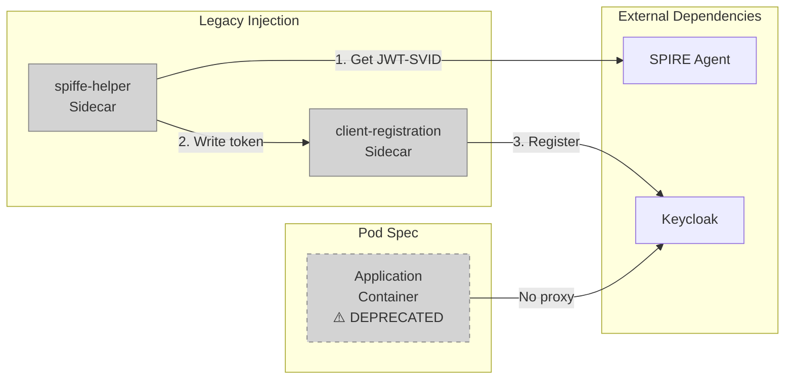
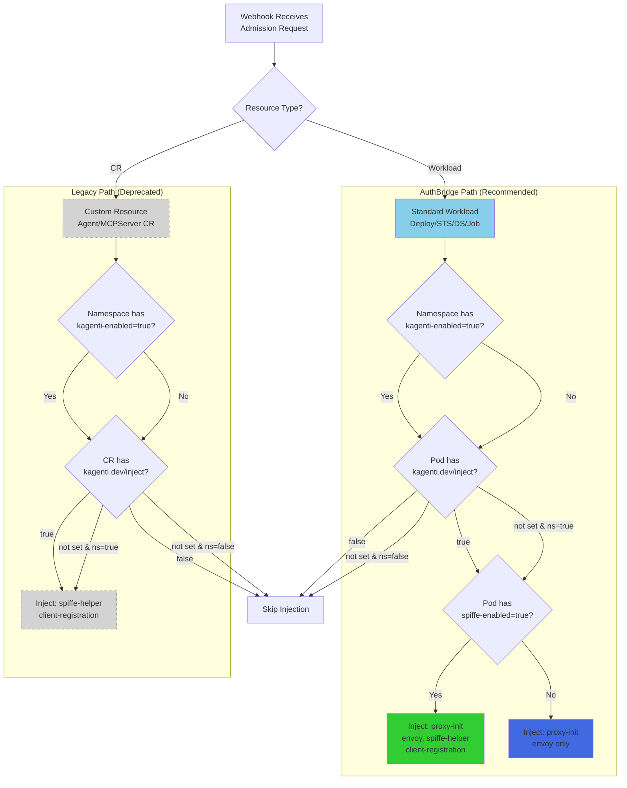

# Kagenti Webhook Architecture

This document provides Mermaid diagrams illustrating the webhook architecture.

## ⚠️ Architecture Update

**The Agent CR and MCPServer CR webhooks are deprecated**. The AuthBridge webhook is the recommended approach for new deployments.

## Component Architecture



## Container Injection Flow

### AuthBridge Webhook - With SPIRE Integration

When `spiffe-enabled: "true"` label is set on the pod template:



### AuthBridge Webhook - Without SPIRE Integration

When `spiffe-enabled` label is **not** set (default):



### Legacy Webhooks - SPIRE Only (Deprecated)

Agent CR and MCPServer CR webhooks always inject SPIRE sidecars:



## Injection Decision Flow



## Key Differences

| Aspect | AuthBridge (Recommended) | Legacy (Deprecated) |
|--------|--------------------------|---------------------|
| **Resources** | Standard K8s workloads | Custom Resources |
| **Injection Control** | Pod labels | CR annotations |
| **SPIRE** | Optional (`spiffe-enabled` label) | Always enabled |
| **Containers** | Init: proxy-init<br/>Sidecars: envoy, spiffe-helper*, client-registration* | Sidecars: spiffe-helper, client-registration |
| **Traffic Management** | ✅ Envoy proxy with iptables | ❌ No proxy |
| **Authentication** | Multiple methods (SPIRE, mTLS, JWT, etc.) | SPIRE only |
| **Method** | `InjectAuthBridge()` | `MutatePodSpec()` |

\* Only injected when `spiffe-enabled: "true"`
```
